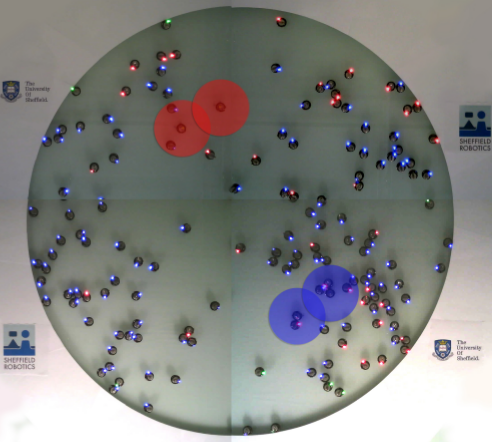
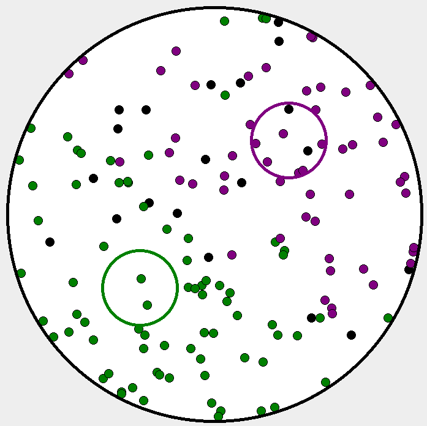
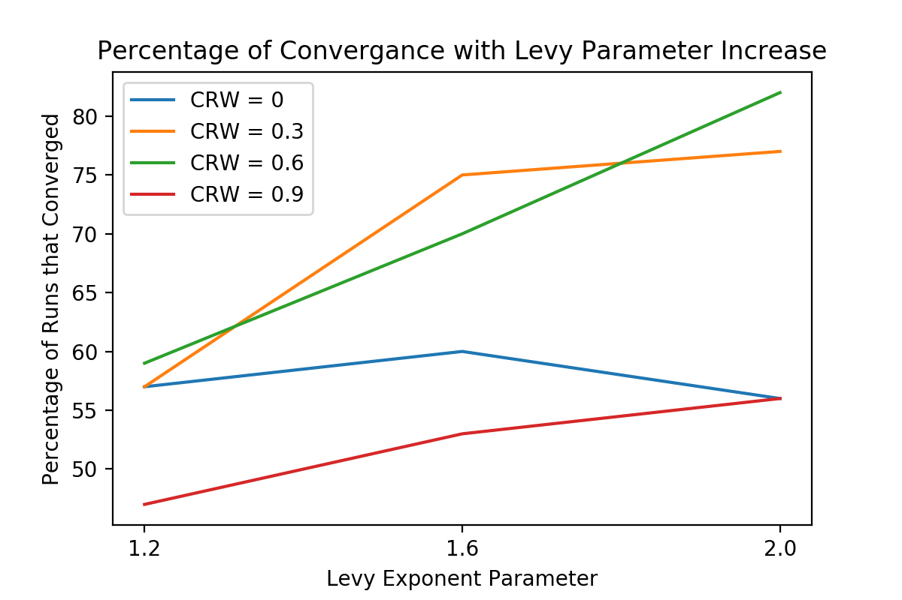
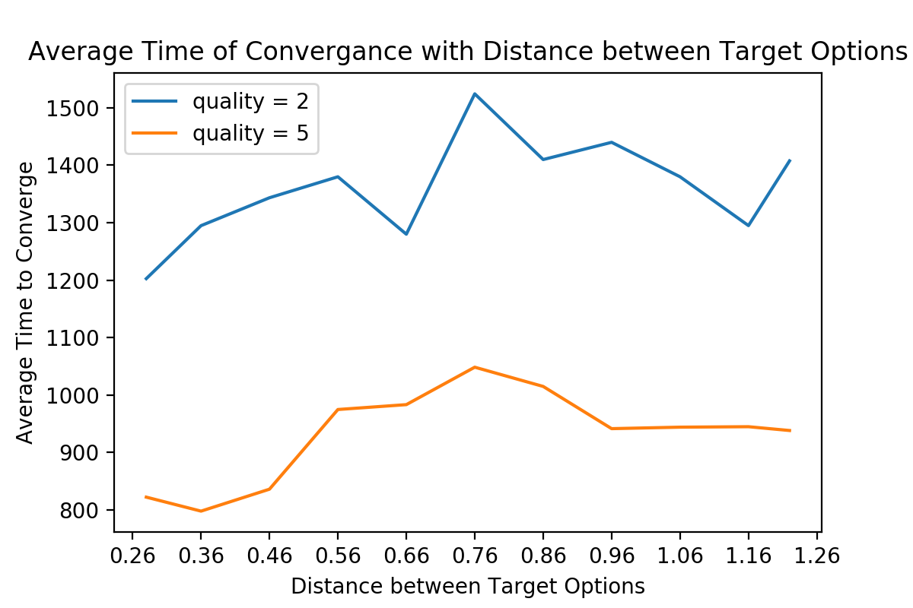

# Multi-Agent_Swarm_Collective-Decision-Making
Multi-agent simulation environment for mobile agents (kilobots) to test decision making for swarm robots.

The goal of the study is understanding the effects of spatiality into a decision-making process in-
spired by the honeybees nest-site selection behaviour. This problem consists in choosing between
two target sites each characterised by a quality value where a higher value describes a better tar-
get. These values provide important information when a decision has to be made by a spatially
dispersed swarm, especially when the targets might need different times to be discovered. The
information about low-quality options should spread slowly, granting time to the robots to possibly
find better-quality options.

An easy and fast decision can be made when the options have different quality values, where the
target with the highest value would win. However, a more complex and interesting scenario is when
both targets have the same quality value, which can lead the swarm to a deadlock situation. In this
case, real bees spread information through the waggle dance and disturb the spread of information
about the competing target using the methods of head-butting and emitting high-pitched beeps, as
mentioned above. Likewise, kilobots and the simulated agents likewise use a decision-making pro-
cess to both simulate the spread of data and the disturbance of such through four decision-making
processes: discovery, recruitment, abandonment and cross-inhibition.

